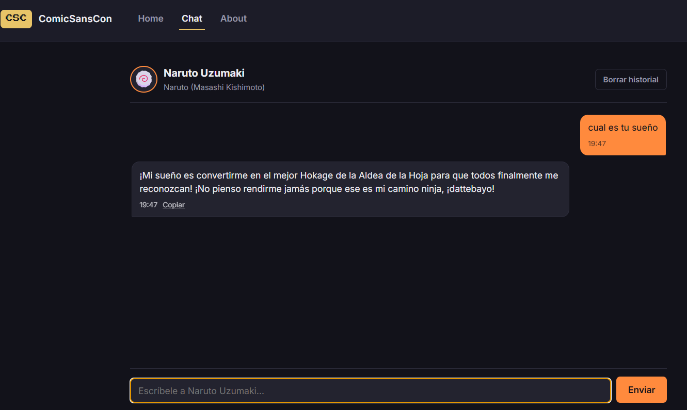
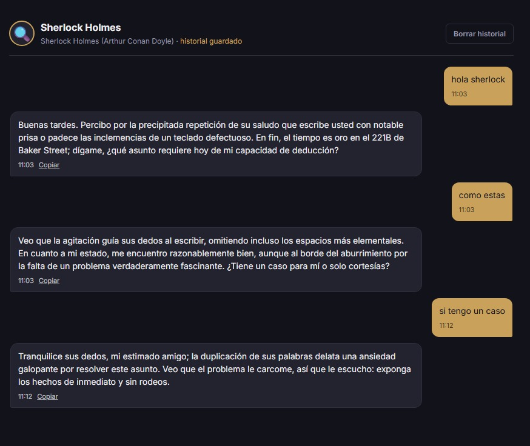
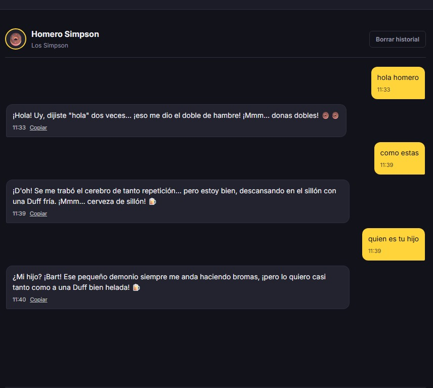

# ComicSansCon · Chatea con tu personaje favorito

Prueba de concepto (POC) de una Single Page Application donde el usuario puede
chatear con personajes ficticios usando **Google Gemini AI**, desarrollada como
ejercicio de frontend junior para la agencia **ComicSansCon**.

## Personajes disponibles

La app incluye una galería con 3 personajes, cada uno con su propio system prompt:

| Personaje | Franquicia | Personalidad |
|---|---|---|
| **Naruto Uzumaki** | Naruto (Masashi Kishimoto) | Hiperactivo, optimista, leal, obsesionado con ser Hokage |
| **Sherlock Holmes** | Sherlock Holmes (A. Conan Doyle) | Analítico, deductivo, ligeramente arrogante |
| **Homero Simpson** | Los Simpson | Glotón, impulsivo, torpe, entrañable |

Podés elegir el personaje desde `/home` y el chat recuerda tu selección.

## Link del repositorio

Abrir https://github.com/joaco2003/ProyectoM3-JoaquinSuarez

## Estructura del proyecto

```
comicsanscon-chat/
├── api/
│   └── chat.js            # Vercel Serverless Function: proxy seguro hacia Gemini
├── src/
│   ├── index.html
│   ├── css/
│   │   └── styles.css     # Diseño mobile-first, temas claro/oscuro
│   └── js/
│       ├── app.js         # Router (History API) + renderizado de vistas
│       ├── chat.js        # Fetch a /api/chat + manejo de errores
│       ├── characters.js  # Datos y system prompts de cada personaje
│       ├── storage.js     # Persistencia de historial en localStorage
│       └── utils.js       # Funciones puras de parseo/transformación
├── tests/
│   ├── utils.test.js
│   └── chat.test.js
├── .env.example
├── .gitignore
├── package.json
└── vercel.json
```

## Requisitos

- Node.js 18+
- Una API key de Google Gemini: https://aistudio.google.com/app/apikey
- [Vercel CLI](https://vercel.com/docs/cli) (`npm i -g vercel`) para correr `vercel dev` localmente

## Cómo correr el proyecto localmente

1. Instalar dependencias:
   ```bash
   npm install
   ```
2. Copiar el archivo de variables de entorno y completar tu API key real:
   ```bash
   cp .env.example .env
   # editar .env y pegar tu GEMINI_API_KEY
   ```
3. Levantar el entorno de desarrollo (sirve tanto el frontend estático como las
   funciones serverless de `/api`):
   ```bash
   vercel dev
   ```
4. Abrir `http://localhost:3000/home` (o el puerto que indique la CLI).

> **Nota:** el frontend nunca ve la API key. Todo el llamado a Gemini pasa por
> `/api/chat.js`, que corre en el servidor y lee `process.env.GEMINI_API_KEY`.

## Cómo correr los tests

```bash
npm test
```

Esto ejecuta Vitest en modo `run` sobre todo `tests/`. Hay tests para:

- `utils.js`: construcción del body de la petición, parseo de la respuesta de
  Gemini, formateo de timestamps, parseo de rutas, truncado de texto.
- `chat.js`: llamada a `/api/chat` con `fetch` **mockeado** (sin red real),
  cubriendo el caso feliz, error HTTP, error de red y validación de mensaje vacío.

Para modo watch mientras desarrollás:

```bash
npm run test:watch
```

## Cómo desplegar a Vercel

1. Subir el repo a GitHub.
2. En [vercel.com](https://vercel.com), **Add New Project** → importar el repo.
3. En **Environment Variables**, agregar:
   - `GEMINI_API_KEY` = tu clave real
   - `GEMINI_MODEL` (opcional, ej. `gemini-2.0-flash`)
4. Deploy. Vercel detecta automáticamente `/api/chat.js` como función
   serverless y `src/` como el sitio estático (configurado en `vercel.json`).
5. Verificar en producción que `/home`, `/chat` y `/about` cargan bien al
   navegar directo por URL (gracias a los rewrites de `vercel.json`), y que el
   chat responde sin exponer la key en las DevTools → Network.

**URL de la app desplegada:** _completar con el link real una vez deployado_
(`https://vercel.com/joaquins-projects-d1206c04/proyecto-m3-joaquin-suarez`)

## Capturas de pantalla





## Registro de uso de IA en el proyecto

Se usó un asistente de IA como herramienta de aprendizaje y aceleración durante
el desarrollo, específicamente para:

- Bocetar la estructura inicial del router SPA basado en History API.
- Redactar y afinar los 3 system prompts (tono, límites, longitud de respuesta).
- Revisar accesibilidad y breakpoints del CSS responsive.
- Generar el set inicial de tests unitarios con Vitest.

Todo el código generado fue revisado, entendido y ajustado manualmente antes
de integrarlo al proyecto final.

## Notas de diseño

- **Mobile-first:** la barra de navegación es inferior (estilo consola) en
  mobile y pasa a un menú superior desde tablet (`min-width: 600px`).
- **Persistencia:** el historial se guarda en `localStorage` por personaje;
  hay un botón "Borrar historial" y un indicador de "historial guardado".
- **Accesibilidad:** foco visible, `aria-live` en la lista de mensajes,
  `prefers-reduced-motion` respetado en el indicador de "escribiendo…".
